# expect-llm

**Zero-dependency Vitest/Jest matchers for LLM output — assert valid JSON, schema shape, required content, structured snapshots, and an optional bring-your-own judge, in the test runner you already use.**

<p>
  <a href="https://www.npmjs.com/package/expect-llm"></a>
  <a href="https://github.com/H1manshu01/expect-llm/actions/workflows/ci.yml"></a>
  <a href="https://bundlephobia.com/package/expect-llm"></a>
  
  <a href="./LICENSE"></a>
</p>



Testing LLM output in a normal test suite means one of two uncomfortable things.
Either you hand-roll the assertion — `JSON.parse` in a `try/catch`, a string of
`includes()` checks, a `schema.parse()` you wrap to turn a throw into a boolean —
and the failure message tells you nothing useful. Or you reach for a full eval
platform: a separate config file, a CLI, a dashboard, an account, and a second
mental model that lives outside the `vitest`/`jest` run you already have.

`expect-llm` is the small middle option: a set of `expect(...)` matchers that
assert the things LLM output actually gets wrong — is it parseable JSON, does it
fit a schema, does it contain the required fields, does it avoid the forbidden
phrases, is it one of a closed set of decisions — with readable failure
messages, in the runner you already run. It is **deterministic by default**; the
one matcher that can consult a model, `toSatisfy`, never calls one itself — you
pass the model call in.

```ts
import { expect } from "vitest";
import { z } from "zod";
import { llmMatchers } from "expect-llm";

expect.extend(llmMatchers); // once, in a setup file

const Invoice = z.object({ total: z.number(), currency: z.string() });

expect(out).toBeValidJSON({ allowFences: true });
expect(out).toMatchSchema(Invoice);             // out may be an object OR a JSON string
expect(out).toContainAll(["total", "currency"]);
expect(out).toContainNone(["TODO", "as an AI"]);
expect(decision).toBeOneOf(["refund", "escalate", "deny"]);
```

No network, no bundled schema library, no config. `.not` works on every matcher.

## Why another one?

LLM output breaks in a handful of predictable ways, and asserting on each one by
hand is tedious and produces bad diagnostics:

- **"Is this even JSON?"** — `JSON.parse` throws; you wrap it, and now a failed
  test says `Unexpected token` instead of *what* came back.
- **"Does it fit my schema?"** — `schema.parse()` throws a `ZodError`; you catch
  it to get a boolean, and lose the per-field reasons in the process.
- **"Did it include the fields / avoid the banned phrases?"** — a pile of
  `expect(text.includes(...)).toBe(true)` with no hint of which item was missing.
- **"Is the decision one of the allowed ones?"** — `toBe` can't express "one of",
  and `toContain` is the wrong tool for a closed set.
- **"Is the shape stable across a prompt refactor?"** — a value snapshot breaks
  every time the model picks a different number; you want the *shape*, not the
  values.

The alternative — adopting promptfoo, DeepEval, or a hosted platform like
Braintrust — is the right call for large eval suites, but it is a lot of
apparatus for "assert this one response in my unit test." `expect-llm` fills the
gap between a brittle hand-rolled assertion and a full eval platform: in-runner,
zero-dependency, deterministic, and it composes with the schema library and the
coercion step you already use.

See [COMPETITORS.md](./COMPETITORS.md) for the full scan.

## Install

```sh
npm install -D expect-llm
```

Zero runtime dependencies. `vitest`, `jest`, and `zod` are **optional** peer
dependencies — install only the ones you use; the library never bundles or
imports them. Node >= 18. Ships ESM + CJS + `.d.ts`, roughly 1.41 kB min+brotli.

## Quick start

Register the matchers **once** in a setup file, then use them anywhere. The two
entry points expose the identical matchers — pick the one for your runner.

### Vitest

```ts
// vitest.setup.ts
import { expect } from "vitest";
import { llmMatchers } from "expect-llm";

expect.extend(llmMatchers);
```

```ts
// vitest.config.ts
import { defineConfig } from "vitest/config";

export default defineConfig({
  test: { setupFiles: ["./vitest.setup.ts"] },
});
```

The `expect-llm` entry augments Vitest's `expect` types, so the matchers are
typed on `expect(...)` and on asymmetric matchers (`expect.toBeOneOf(...)`).

### Jest

```ts
// jest.setup.ts
import { llmMatchers } from "expect-llm/jest";

expect.extend(llmMatchers);
```

```js
// jest.config.js
module.exports = {
  setupFilesAfterEnv: ["./jest.setup.ts"],
};
```

The `expect-llm/jest` entry augments `jest.Matchers`, so the matchers are typed
on Jest's `expect(...)`.

## Matchers

Every matcher works with `.not`. Values are stringified where noted, so you can
assert against an object or the raw string the model returned.

| Matcher | Signature | Asserts |
|---|---|---|
| `toBeValidJSON` | `toBeValidJSON(options?: { allowFences?: boolean })` | The value is a **string** that `JSON.parse`s without throwing. With `allowFences: true`, a single surrounding markdown code fence (```` ```json ... ``` ```` or an inline `` `...` ``) is stripped first. A non-string value fails. |
| `toContainAll` | `toContainAll(items: string[])` | **Every** item is a substring of the value (stringified if not already a string). The failure message lists the items that were missing. |
| `toContainNone` | `toContainNone(items: string[])` | **None** of the items appear in the value. Good for banned phrases (`"as an AI"`, `"TODO"`). The failure lists the ones that were present. |
| `toContainAny` | `toContainAny(items: string[])` | **At least one** item appears in the value. |
| `toBeOneOf` | `toBeOneOf(allowed: unknown[])` | The value **deep-equals** one of the allowed values. Uses the runner's own deep-equality when available. For a closed decision set. |
| `toMatchStructure` | `toMatchStructure(reference)` | The value has the **same shape** as `reference` — the same keys and the same value *types*, recursively — ignoring the actual values and array length (each array element is checked against `reference[0]`). Distinguishes `null` from other types. A stable snapshot across prompt refactors. |
| `toMatchSchema` | `toMatchSchema(schema)` | The value validates against a **Zod schema or any [Standard Schema](https://standardschema.dev/)** (`~standard`). A string value is JSON-parsed first (code fences tolerated). The failure message lists the per-field issues. Synchronous. |
| `toSatisfy` | `toSatisfy(rubric: string, judge: Judge)` | **Async, opt-in.** The value satisfies a natural-language `rubric`, as decided by a `judge` **you** supply. The only matcher that can involve a model — and it never calls one itself. `await` it. |

### `toMatchSchema` — Zod or Standard Schema, string or object

The schema library is **yours** — `toMatchSchema` never imports or bundles one.
It accepts a Zod schema (via its `safeParse`) or any validator implementing the
[Standard Schema](https://standardschema.dev/) interface (`~standard`), so Valibot,
ArkType, and others work unchanged. If the value is a string it is JSON-parsed
first (a surrounding code fence is tolerated), so you can assert directly on the
raw model output:

```ts
const Invoice = z.object({ total: z.number(), currency: z.string() });

expect({ total: 42, currency: "USD" }).toMatchSchema(Invoice);  // object
expect('{"total":42,"currency":"USD"}').toMatchSchema(Invoice); // JSON string
expect('```json\n{"total":42,"currency":"USD"}\n```').toMatchSchema(Invoice); // fenced
```

Validation is **synchronous**. A Standard Schema whose `validate` returns a
promise (async validation) throws a clear error rather than silently passing —
`toMatchSchema` is for deterministic shape checks, not async rules.

### `toMatchStructure` — shape, not values

`toMatchStructure` compares keys and value *types*, ignoring the values
themselves and the length of arrays. It is for snapshotting the *shape* of a
structured response so the test survives a prompt refactor that changes the
numbers but not the schema:

```ts
const reference = { id: 1, name: "x", tags: ["a"], meta: { active: true } };

expect({ id: 9, name: "y", tags: ["p", "q"], meta: { active: false } })
  .toMatchStructure(reference);   // passes — same keys, same types

expect({ id: "9", name: "y", tags: ["p"], meta: { active: true } })
  .not.toMatchStructure(reference); // fails — id is a string, not a number

expect({ a: null }).toMatchStructure({ a: null }); // null is distinguished from other types
```

## Deterministic by default; the judge is opt-in

Seven of the eight matchers are **pure, synchronous, offline** functions over a
value. They make **no network call** — a guard test fails the build if any of
them so much as touches `fetch`. They are the right tool for the things that are
objectively checkable: valid JSON, schema conformance, required or forbidden
content, a closed decision set, a stable shape. Lean on these first; they are
fast, free, and reproducible.

For the genuinely subjective checks — "is this a polite refusal?", "does this
answer the question without hallucinating a policy?" — there is `toSatisfy`, and
it is deliberately **bring-your-own-model**. `expect-llm` ships no SDK, no API
key handling, and no default model. You pass a `Judge`:

```ts
type JudgeResult = { pass: boolean; reason?: string };
type Judge = (output: string, rubric: string) => JudgeResult | Promise<JudgeResult>;
```

```ts
// You own the model call — any SDK, any provider, any local model.
const judge: Judge = async (output, rubric) => {
  const verdict = await myModel(`Does this satisfy "${rubric}"?\n\n${output}\n\nAnswer yes or no.`);
  return { pass: /yes/i.test(verdict), reason: verdict };
};

await expect(answer).toSatisfy("is a concise, polite refusal", judge);
```

Because the judge is a plain function, it is also trivially mockable: a
deterministic stub judge lets you test the *wiring* in CI without spending tokens
or making a network call, and the real judge runs only where you want it to. The
`reason` a judge returns is surfaced in the failure message, so a rejected
assertion tells you *why*.

## How it compares

`expect-llm` is not an eval platform and does not try to be. It is the in-runner
assertion layer. Here is where it sits relative to the tools people reach for.
Claims about third-party projects are **as of early 2026** — re-check each one
before quoting it; see [COMPETITORS.md](./COMPETITORS.md) for the detailed scan.

| | expect-llm | promptfoo | DeepEval | Braintrust | Evalite / vitest-evals | jest-extended | semantic-expect |
|---|:---:|:---:|:---:|:---:|:---:|:---:|:---:|
| Runs inside your existing test runner | Vitest + Jest | own CLI | pytest (Python) | SDK + hosted | Vitest only | Jest only | Jest/Vitest |
| Deterministic matchers (no model needed) | Yes | Partial | Partial | Partial | Partial | Yes (general) | No (embeddings) |
| LLM judge | opt-in, BYO model | built-in | built-in | built-in | via scorers | — | — (uses embeddings) |
| Schema-shape matcher (Zod / Standard Schema) | Yes | — | — | — | — | — | — |
| Zero runtime dependencies | Yes | No | No | No | No | No | No |
| No account / service / config file | Yes | config file | — | account | config | Yes | Yes |
| Purpose-built for LLM output | Yes | Yes | Yes | Yes | Yes | No | Partial |

The short version: **jest-extended** adds general-purpose matchers but nothing
LLM-specific; **semantic-expect** does embedding-similarity matching (a different,
non-deterministic axis, and a model dependency); **Evalite / vitest-evals** is an
in-runner eval *harness* with scorers, heavier than a matcher set and
Vitest-only; **promptfoo**, **DeepEval**, and **Braintrust** are full eval
frameworks or platforms — the right tool for large graded eval suites, more
apparatus than you want for asserting one response in a unit test. `expect-llm`
is the deterministic, zero-dependency, in-runner matcher layer that works in both
Vitest and Jest and keeps the model call opt-in.

## Guardrails

The small set of promises that make these matchers safe to leave in a suite,
each backed by a test:

- **Zero runtime dependencies.** A packaging test asserts `dependencies` is empty.
  `vitest`, `jest`, and `zod` are optional peers, never bundled or imported.
- **Deterministic matchers make no network call.** A guard test spies on
  `globalThis.fetch` and fails if any of the seven deterministic matchers touches
  it.
- **The judge is strictly opt-in and model-agnostic.** `toSatisfy` never calls a
  model; it invokes the `Judge` you pass. No SDK, no key handling, no default
  provider ships in the package.
- **`.not` works for every matcher.** Each returns a `{ pass, message }` pair with
  both the positive and negated failure message, so negation reads correctly.
- **Readable failures.** Messages name what was missing, which items were present,
  which path mismatched, or the judge's reason — not a raw thrown error.

The suite is 26 tests, covering every matcher, both entry points, the packaging
invariants, and the no-`fetch` guard.

## Pairs with coerce-json and zod

`expect-llm` is the **assertion** end of the author's LLM dev-tools line. In a
structured-output flow it sits naturally after
[`coerce-json`](https://www.npmjs.com/package/coerce-json), which repairs and
coerces almost-valid model output to fit a schema. Coerce first, then assert on
the result — `toMatchSchema` takes the very same Zod schema:

```ts
import { coerce } from "coerce-json/zod";
import { z } from "zod";

const Invoice = z.object({ total: z.number(), currency: z.string() });

const { value, ok } = coerce(rawModelOutput, Invoice); // repair + coerce
expect(ok).toBe(true);
expect(value).toMatchSchema(Invoice);                  // assert the shape
expect(value).toContainAll(["total", "currency"]);     // and the content
```

The wider suite (same author, all zero-dependency):

- **[`sse-wire`](https://www.npmjs.com/package/sse-wire)** — fetch-based SSE client; POST the request, stream the events.
- **[`trickle-json`](https://www.npmjs.com/package/trickle-json)** — assemble streamed JSON into the best valid partial value on every chunk.
- **[`coerce-json`](https://www.npmjs.com/package/coerce-json)** — repair and coerce that value to fit your Zod / JSON Schema, logging every fix.
- **[`trickle-react`](https://www.npmjs.com/package/trickle-react)** — React hooks that render the streaming pipeline field by field.
- **[`trickle-structured`](https://www.npmjs.com/package/trickle-structured)** — the **capstone**: one call from `fetch` to a validated object, composing the three pipeline packages.
- **[`retry-wire`](https://www.npmjs.com/package/retry-wire)** — provider-aware retry and throttle for the request that opens the stream.
- **[`context-budgeter`](https://www.npmjs.com/package/context-budgeter)** — fit a chat history into the model's context window.
- **[`expect-llm`](https://www.npmjs.com/package/expect-llm)** — assert the result in Vitest or Jest. *(this package)*

```
fetch -> SSE (sse-wire) -> parse partial JSON (trickle-json) -> coerce to schema (coerce-json) -> assert (expect-llm)
```

## Development

```sh
npm install
npm test          # vitest run (matchers, both entries, guards)
npm run typecheck
npm run build     # tsup -> ESM + CJS + .d.ts
npm run size      # size-limit (zero-dep core)
npm run lint      # Biome
```

## License

MIT (c) Himanshu Sharma
